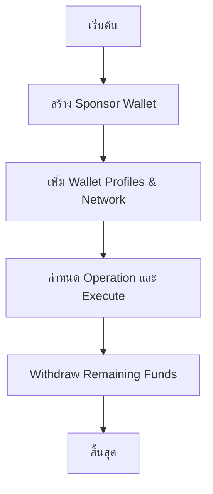
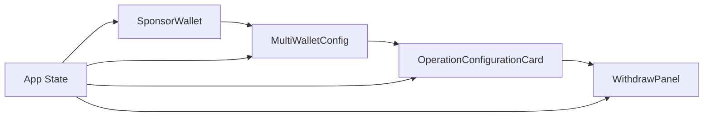

src/
├── App.tsx                    # Main Application Component
├── components/
│   ├── ui/                   # Reusable UI Components
│   │   ├── Button.tsx
│   │   ├── Card.tsx
│   │   ├── Input.tsx
│   │   ├── Label.tsx
│   │   ├── Select.tsx
│   │   ├── Tabs.tsx
│   │   ├── Textarea.tsx
│   │   ├── alert.tsx
│   │   ├── badge.tsx
│   │   ├── switch.tsx
│   │   └── background-ripple-effect.tsx
│   ├── BatchExecutor.tsx     # Batch Execution Component (legacy)
│   ├── DelegationPanel.tsx   # EIP-7702 Delegation Management (legacy)
│   ├── MultiWalletConfig.tsx # Multi-Wallet Configuration
│   ├── OperationConfigurationCard.tsx # Operation setup & execution
│   ├── SponsorWalletCard.tsx # Sponsor Wallet Management
│   └── WithdrawPanel.tsx     # Fund Withdrawal
├── lib/                      # Business Logic
│   ├── batchOps.ts          # Batch Operations Logic
│   ├── eip7702.ts           # EIP-7702 Implementation
│   ├── rpc.ts               # Network Configuration
│   ├── utils.ts             # Utility Functions
│   └── wallet.ts            # Wallet Operations
└── styles/
    ├── App.css
    └── index.css
```

## การทำงานของระบบ (Workflow)

### 1. การทำงานหลัก (Main Workflow)


### 2. Flow ของแต่ละขั้นตอน

> **หมายเหตุ**: ใน UI ล่าสุดขั้นตอนที่ 2-3 ถูกจัดกลุ่มอยู่ภายในแท็บ **Batch Ops** เพื่อลดการสลับหน้าจอและให้ผู้ใช้ทำงานตามลำดับในหน้าจอเดียว.

#### Step 1: Sponsor Wallet Configuration
- **จุดประสงค์**: สร้าง wallet สำหรับจ่าย gas fees
- **Component**: `SponsorWalletCard.tsx`
- **ฟีเจอร์**:
  - Generate new wallet (private key + mnemonic)
  - Display address with copy/explorer links
  - Show/hide sensitive data (private key, mnemonic)
  - Balance checking per network
  - Download backup as JSON
  - Security warnings and best practices

#### Step 2: Multi-Wallet Configuration
- **จุดประสงค์**: เพิ่ม wallets ที่ต้องการทำ airdrop
- **Component**: `MultiWalletConfig.tsx`
- **ฟีเจอร์**:
  - Add up to 5 wallets with pill-style selector
  - Duplicate existing wallet configurations with one click
  - Rename wallet profiles
  - Select network per wallet (Ethereum Mainnet, BSC, Arbitrum, Base, Polygon)

#### Step 3: Operation Configuration & Execution
- **จุดประสงค์**: กำหนดค่ารายละเอียดการทำงานและสั่ง Execute
- **Component**: `OperationConfigurationCard.tsx`
- **ฟีเจอร์**:
  - เลือก Operation type (Only Claim / Only Transfer / Claim and Transfer)
  - กรอก compromised private key พร้อม helper text
  - ระบุ Airdrop/Target contract address
  - ใส่ Claim Hex Data
  - ตั้งค่า Claim Value (WEI)
  - ปุ่ม `Execute All Wallets (n)` พร้อมคำอธิบายการดีเลย์

#### Step 4: Withdraw Funds
- **จุดประสงค์**: ถอนเงินคงเหลือจาก sponsor wallet
- **Component**: `WithdrawPanel.tsx`
- **ฟีเจอร์**:
  - Address validation with copy helper for sponsor wallet
  - One-click “Withdraw All Remaining Balance” with automatic gas reservation
  - Balance checking per network
  - Transaction tracking with explorer link

## โครงสร้าง UI Components

### Main App Component (App.tsx)
```typescript
// State Management
const [sponsorWallet, setSponsorWallet] = useState<SponsorWalletData | null>(null);
const [walletConfigs, setWalletConfigs] = useState<WalletConfig[]>([]);
const [selectedWalletId, setSelectedWalletId] = useState<string | null>(null);
const [isDarkMode, setIsDarkMode] = useState(false);

// UI Structure
- Background Ripple Effect
- Global Status Alerts
- Navigation Bar with Dark Mode Toggle
- Tab Navigation: Generator | Batch Ops | Withdraw
```

### Component Hierarchy
```
App
├── BackgroundRippleEffect
├── Global Alerts
├── Navigation
├── Tabs
    ├── Generator
    │   └── SponsorWalletCard
    ├── Batch Ops
    │   ├── MultiWalletConfig
    │   └── OperationConfigurationCard
    └── Withdraw
        └── WithdrawPanel
```

## การจัดการ State และ Data Flow

### State Management Pattern
- **Local State**: ใช้ React hooks (useState) สำหรับ state ภายใน component
- **Props Drilling**: ส่ง state และ setters ผ่าน props
- **Global State**: ไม่มีการใช้ global state management (Redux/Context)

### Data Flow


## การออกแบบ UI/UX

### Design System
- **Color Scheme**: Light/Dark mode support
- **Typography**: Sora font family
- **Spacing**: Consistent Tailwind spacing
- **Components**: Shadcn UI components สำหรับความสม่ำเสมอ

### Responsive Design
- Container: `max-w-6xl mx-auto`
- Grid layouts: `grid-cols-1 md:grid-cols-2`
- Mobile-first approach แต่ยังไม่มี mobile optimization ที่ชัดเจน

### User Experience Features
- Real-time status updates
- Loading states และ progress indicators
- Error handling และ user feedback
- Copy-to-clipboard functionality
- External links to block explorers
- Security warnings และ best practices

## การจัดการ Network

### Supported Networks
- Ethereum
- BSC (Binance Smart Chain)
- Arbitrum
- Base
- Polygon

### Network Configuration
- RPC URLs และ chain IDs
- Block explorer URLs
- Native currency symbols
- Gas estimation per network

## Security Considerations

### Security Features
1. **Private Key Handling**: Show/hide toggle
2. **Mnemonic Phrase**: Partial display with show/hide
3. **Delegation Expiry**: Time-limited delegations (24 hours)
4. **Function Whitelisting**: Only allowed functions can be executed
5. **Warnings**: Multiple security warnings throughout UI

### Risk Areas
1. **Private Keys**: Stored in state (memory only)
2. **No Encryption**: Private keys ไม่มีการ encrypt
3. **Client-side**: All operations happen client-side
4. **No Audit**: Contract addresses ไม่มีการ verify

## ปัญหาที่อาจเกิดขึ้นและพื้นที่ปรับปรุง

### Potential Issues
1. **Performance**: Large number of wallets อาจทำให้ช้า
2. **Memory**: Private keys ใน memory อาจเป็นปัญหา security
3. **Mobile UI**: ยังไม่ optimized สำหรับ mobile
4. **Error Handling**: บาง error cases ยังไม่ครอบคลุม
5. **Accessibility**: ยังไม่มี accessibility features

### Improvement Areas
1. **State Management**: พิจารณาใช้ Context หรือ Redux
2. **Validation**: เพิ่ม validation แบบ real-time
3. **Progress Tracking**: เพิ่ม progress bars และ better feedback
4. **Mobile Optimization**: Responsive design improvements
5. **Security Features**: Add PIN/password protection
6. **Internationalization**: Add multi-language support

## การทำงานของ Key Features

### EIP-7702 Delegation
- Purpose: Allow batch contract to execute specific functions
- Implementation: Cryptographic signatures with expiry
- Security: Function whitelisting + time limits
- Revocation: Can be revoked anytime

### Batch Execution
- Processing: Sequential with 2-second delays
- Gas Optimization: Sponsor wallet pays all gas
- Mempool: Private (Flashbots) or public options
- Monitoring: Real-time logs with transaction links

### Background Ripple Effect
- Visual enhancement สำหรับ modern look
- Grid-based animation ที่ responsive
- Performance optimized ด้วย CSS animations

---

**สรุป**: นี่คือระบบ airdrop batch executor ที่มีฟีเจอร์ครบถ้วน มีการจัดการ multiple wallets, delegation system, และ batch execution ที่ secure ด้วย EIP-7702 การออกแบบ UI ใช้ modern React patterns กับ Tailwind CSS แต่ยังมีพื้นที่สำหรับปรับปรุงด้าน performance, security, และ mobile optimization
